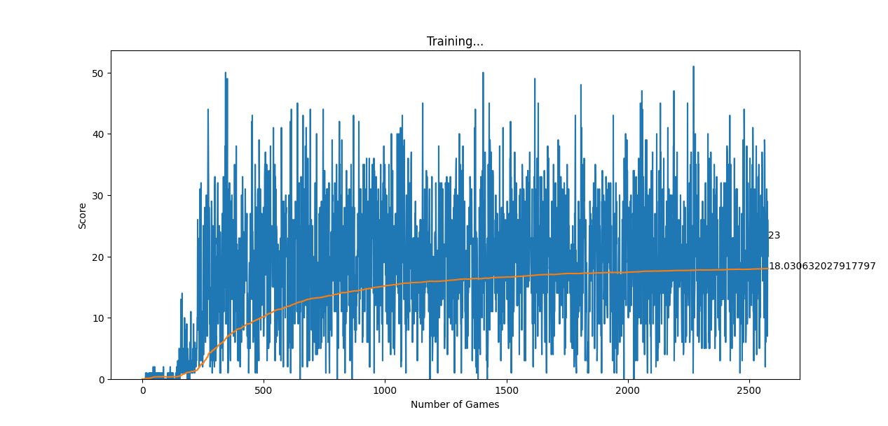

# Snake Agent 

  

Welcome to my first hands-on project with reinforcement learning! This simple yet exciting project is all about teaching an agent to play the classic Snake game using **Deep Q-Learning**The agent learns through trial and error, improving its strategy step by step.&#x20;

> Watching it get better is incredibly satisfying! 

## How It Works ?

### Game Setup 

The Snake game is created using **Pygame**, where the agent interacts with the environment by moving the snake and responding to rewards or penalties.

### Learning Process 

**State Representation**: The game state is broken down into 11 features, such as food location, direction, and danger detection.

**Actions**: The agent can: Move straight, Turn left and Turn right

**Rewards**: +10 for eating food., -10 for hitting a wall or itself.

**Training**: Learns immediately from recent moves (short-term memory) and Uses past experiences to improve stability (long-term memory).

### The Agent’s Journey 

  

In the beginning, the agent should move randomly, bumping into walls and itself frequently. With each game, the agent should become smarter, understanding where the food is and avoiding collisions more often. Ideally, after many games, the agent should become a skilled player, maneuvering the snake like a pro, finding food efficiently, and avoiding danger. However, the model's mean score showed a logarithmic scale pattern, indicating that a deeper model is required for further training.

## License 

This project is licensed under the MIT License.
